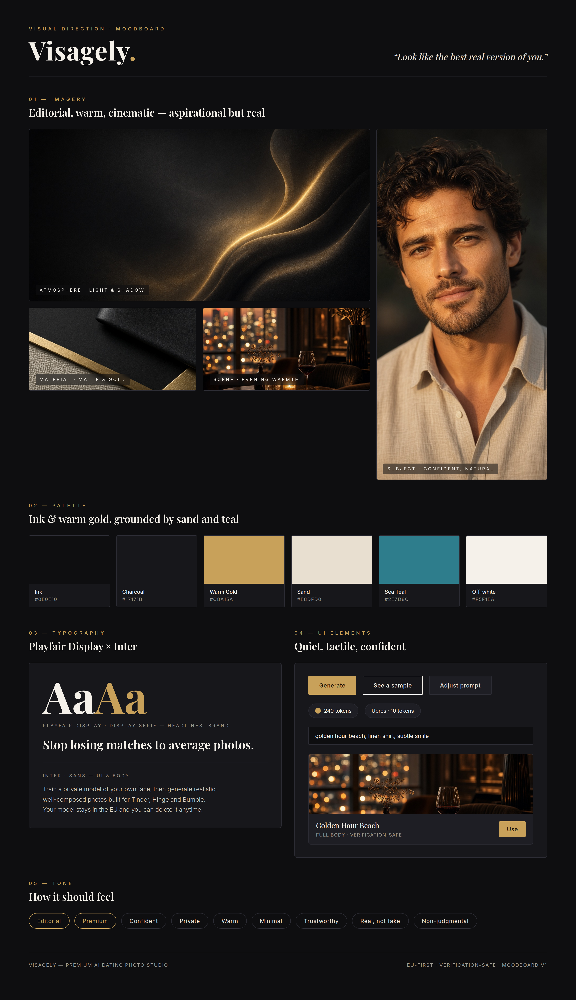

# Visagely — Moodboard

Visual direction for a **premium, high-end-fashion editorial** website. Polish signals trust,
which directly counters the "is this a cheap scam / will it look fake?" objection.

> Source: [`moodboard.html`](moodboard.html) (rendered with headless Chrome). Imagery in
> `assets/` is AI-generated mood reference, not product output.

## Palette

| Token | Hex | Use |
| --- | --- | --- |
| Ink | `#0E0E10` | Primary background |
| Charcoal | `#17171B` | Panels / cards |
| Warm Gold | `#C8A15A` | Primary accent, CTAs, "pay" moments |
| Sand | `#E8DFD0` | Secondary text, quiet highlights |
| Sea Teal | `#2E7D8C` | Secondary accent (utility, tags) |
| Off-white | `#F5F1EA` | Primary text on dark |

Direction: **ink & warm gold**, grounded by sand and a restrained teal. Dark, low-key, warm —
never neon or "techy."

## Typography

- **Display / brand — Playfair Display** (serif). Headlines, brand, editorial statements.
- **UI / body — Inter** (sans). Interface, buttons, paragraphs; use light/regular weights for body.
- Scale: large serif headlines with generous whitespace; small, wide-tracked uppercase eyebrows
  (`letter-spacing ~0.4em`) in gold for section labels.

## Imagery direction

- **Editorial, warm, cinematic — aspirational but real.** Golden-hour and low-key warm interiors,
  shallow depth of field, authentic skin texture.
- **Do:** natural light, real texture, confident-but-relaxed subjects, tasteful negative space.
- **Don't:** over-smoothed "AI look," plastic skin, neon/sci-fi, stocky corporate headshots,
  over-glamorized or misleading looks (breaks the verification-safe promise).

## UI tokens

- **Buttons:** primary = solid gold on ink; secondary = ghost (off-white hairline); quiet = panel
  fill. Small radius (~2px), generous padding, wide tracking.
- **Pills:** token balance and per-action cost (e.g. "Upres · 10 tokens") — always show cost.
- **Cards:** charcoal fill, hairline border (`#2C2C34`), ~6px radius, image-topped template cards.
- **Inputs:** ink fill, hairline border, off-white text.
- **Radius/spacing:** restrained radii; lots of breathing room; hairline dividers, not heavy rules.

## Motion

Subtle and tasteful — soft fades, gentle image reveals, slow easing. No bouncy or playful motion.

## Voice & tone

Confident, private, respectful, **non-judgmental**. Lead line: **"Look like the best real version
of you."** Never "become better-looking than you are."

Keywords: *Editorial · Premium · Confident · Private · Warm · Minimal · Trustworthy · Real, not
fake · Non-judgmental.*
