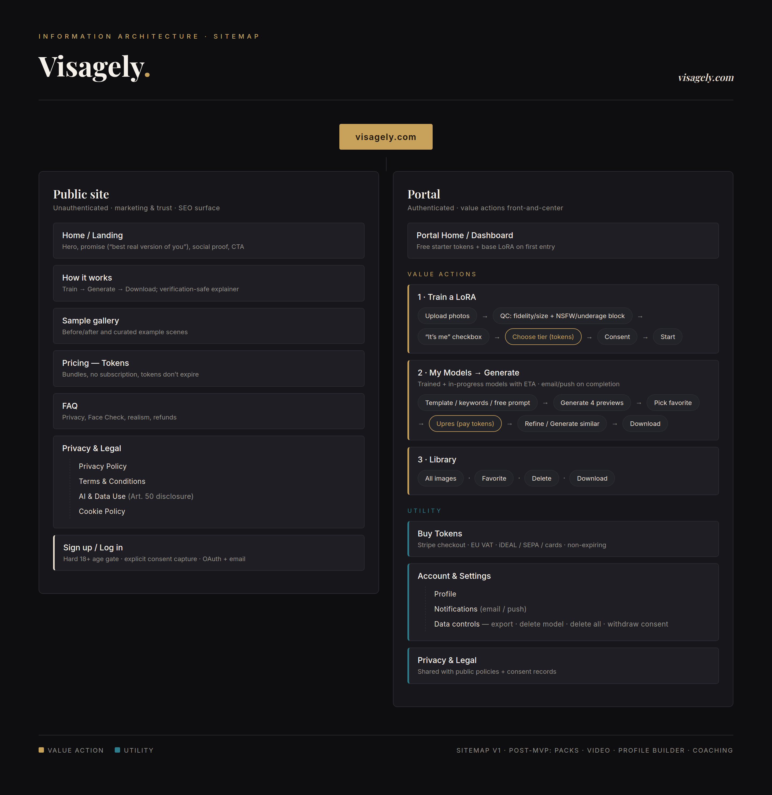
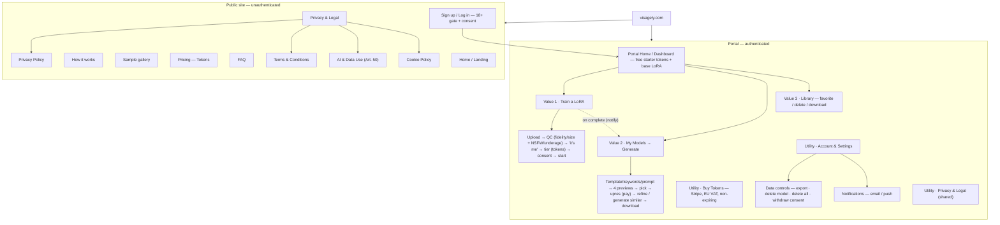

# Visagely — Sitemap

Information architecture for the site: a **public marketing surface** (unauthenticated, SEO/trust)
and the **authenticated portal** with value actions front-and-center.

> Source: [`sitemap.html`](sitemap.html) (rendered with headless Chrome).

## Diagram

## Page tree

### Public site (unauthenticated)

- **Home / Landing** — hero, promise ("best real version of you"), social proof, primary CTA.
- **How it works** — Train → Generate → Download; verification-safe explainer.
- **Sample gallery** — before/after and curated example scenes.
- **Pricing — Tokens** — bundles, no subscription, tokens don't expire.
- **FAQ** — privacy, Face Check, realism, refunds.
- **Privacy & Legal** — Privacy Policy · Terms & Conditions · AI & Data Use (Art. 50 disclosure) ·
  Cookie Policy.
- **Sign up / Log in** — hard 18+ age gate, explicit consent capture, OAuth + email.

### Portal (authenticated)

- **Portal Home / Dashboard** — free starter tokens + base LoRA on first entry; value actions
  front-and-center.
- **Value 1 · Train a LoRA** — upload photos → QC (fidelity/size + NSFW/underage block) → "it's me"
  checkbox → choose tier (tokens) → consent → start.
- **Value 2 · My Models → Generate** — trained + in-progress models with ETA (email/push on
  completion) → generation: template / keywords / free prompt → 4 previews → pick favorite → upres
  (pay tokens) → refine / generate similar → download.
- **Value 3 · Library** — all images; favorite / delete / download.
- **Utility · Buy Tokens** — Stripe checkout, EU VAT, iDEAL/SEPA/cards, non-expiring.
- **Utility · Account & Settings** — profile; notifications (email/push); data controls (export,
  delete model, delete all data, withdraw consent).
- **Utility · Privacy & Legal** — shared with public policies + consent records.

## Post-MVP additions

Packs (curated template bundles) · Video support · Profile builder (app presets, slot ordering) ·
Coaching.
